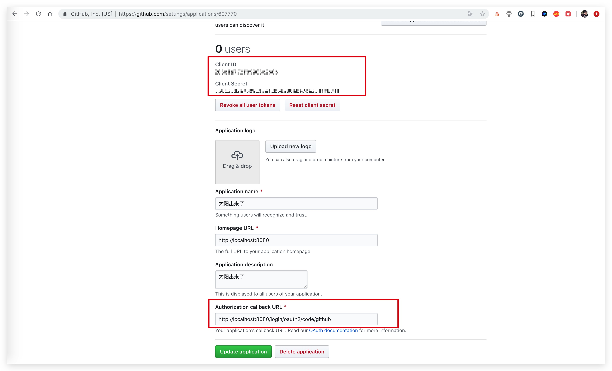
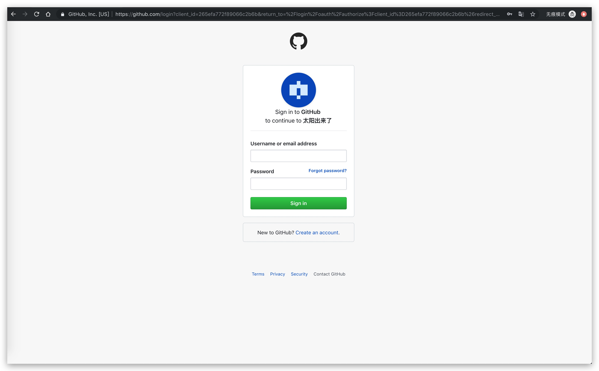

# spring-boot-oauth2-client-demo

> spring boot 2.x 集成 oauth2 client

## 示例

代码以对接 `Github` 为例

- 到 `Github` 申请 OAuth APP。



- 然后，修改配置

```yml
servlet:
  port: 8080

spring:
  security:
    oauth2:
      client:
        provider:
          github:
            authorization-uri: https://github.com/login/oauth/authorize
            token-uri: https://github.com/login/oauth/access_token
            user-info-uri: https://api.github.com/user
            user-name-attribute: name
        registration:
          github:
            authorization-grant-type: authorization_code
            client-authentication-method: basic
            client-name: Github Client
            # 申请到的Client ID
            client-id: xxx
            # 申请到的Client Secret
            client-secret: xxx
            provider: github
            # 申请填写的Authorization callback URL
            redirect-uri-template: xxx
            scope: default
```

- 启动，浏览器输入 `http://localhost:8080` 会跳转到 `Github` 网站



- 输入 Github 账号后，则会跳转回本网站

## 成功回调

如果需要 Github 账号与自己网站的账号绑定，那么需要关联起来。

```java
package tk.fishfish.oauth2.client.configuration;

import org.slf4j.Logger;
import org.slf4j.LoggerFactory;
import org.springframework.security.core.Authentication;
import org.springframework.security.web.authentication.SavedRequestAwareAuthenticationSuccessHandler;
import org.springframework.stereotype.Component;

import javax.servlet.ServletException;
import javax.servlet.http.HttpServletRequest;
import javax.servlet.http.HttpServletResponse;
import java.io.IOException;

/**
 * 自定义认证成功处理
 *
 * @author 奔波儿灞
 * @since 1.0
 */
@Component
public class CustomSavedRequestAwareAuthenticationSuccessHandler extends SavedRequestAwareAuthenticationSuccessHandler {

    private static final Logger LOG = LoggerFactory.getLogger(CustomSavedRequestAwareAuthenticationSuccessHandler.class);

    @Override
    public void onAuthenticationSuccess(HttpServletRequest request, HttpServletResponse response, Authentication authentication)
            throws ServletException, IOException {
        // 这里仅仅打印了当前登录的oauth2用户信息
        // 可以做一些用户同步操作，比如没有在本平台绑定手机号啥的，进行跳转，要求绑定什么的。
        String name = authentication.getName();
        LOG.info("oauth2 authentication success, user: {}", name);
        super.onAuthenticationSuccess(request, response, authentication);
    }

}
```

